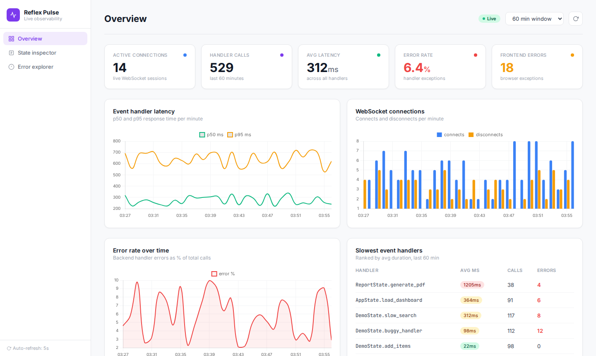
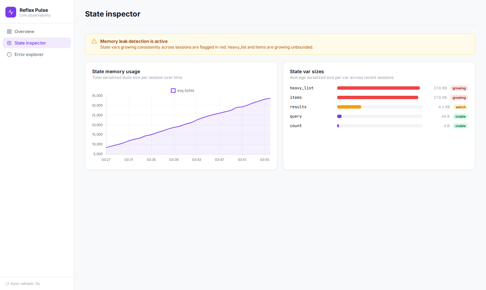
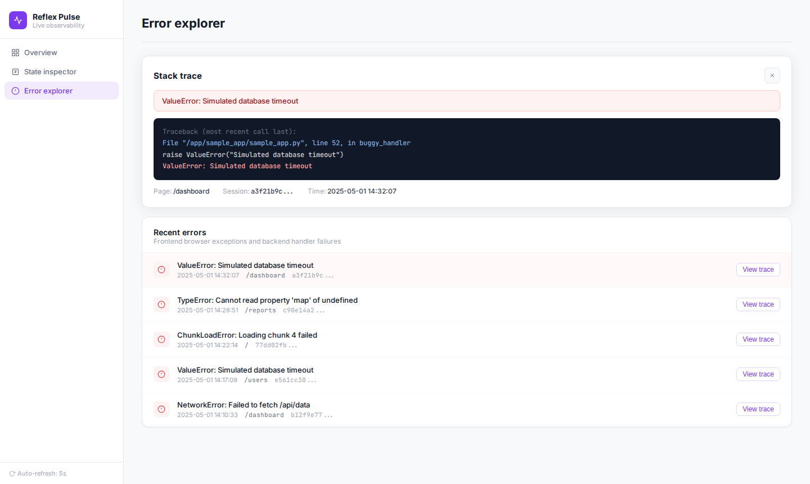

# Reflex Pulse

Live observability for production Reflex apps. Built entirely with the Reflex stack.



Reflex Pulse gives engineering teams real-time visibility into their running Reflex apps without adding external monitoring infrastructure. It plugs in with two lines of Python, surfaces the metrics that actually matter for Reflex's architecture, and runs entirely on the same stack your team already uses.

---

## What it does

**Overview dashboard** shows active WebSocket connections, event handler call volume, average latency, error rate, and frontend exceptions. Everything updates every 5 seconds via Reflex's own state sync.

**Event handler profiler** wraps every async event handler at startup and records p50/p95/p99 latency per handler. The leaderboard surfaces which handlers are blocking the event loop and which are causing the most errors.

**State inspector** tracks the serialized size of every `rx.State` var across sessions over time. Vars growing unbounded are flagged automatically. This catches the most common production memory leak in Reflex apps: appending to a list var without pruning it.

**Error explorer** captures both frontend JavaScript exceptions and backend Python tracebacks, correlates them by WebSocket session token, and stores a full state snapshot at the time of the error. One click shows the complete stack trace.

**WebSocket health monitor** tracks connect/disconnect events in real time and shows connection churn per minute.

---

## Architecture

Pulse uses Reflex's own stack all the way down.

```
PulseCollector (your app)
    |
    | Redis pub/sub  (python-socketio + redis.asyncio)
    v
Ingestion worker (asyncio background task)
    |
    | SQLModel + Alembic
    v
SQLite  (pulse.db)
    |
    | SQLAlchemy queries
    v
rx.State (PulseState)
    |
    | WebSockets + dirty var tracking
    v
Reflex frontend (Next.js + Radix + recharts)
```

The collector patches event handlers at runtime using Python decorators. No changes to your app's logic. The ingestion worker subscribes to Redis pub/sub inside a Reflex background task. The dashboard state polls SQLite every 5 seconds and pushes only dirty vars to the frontend.

---

## Setup

**Prerequisites**

```bash
brew install redis
brew services start redis
python3 -m pip install uv
```

**Install**

```bash
git clone https://github.com/Rabba-Meghana/Reflex-Pulse-A-Live-Enterprise-App-Health-Dashboard
cd Reflex-Pulse-A-Live-Enterprise-App-Health-Dashboard
uv venv && source .venv/bin/activate
uv pip install -r requirements.txt
```

**Seed sample data and run**

```bash
python scripts/seed_data.py
reflex run
```

Open `http://localhost:3000`.

---

## Instrument your own Reflex app

Add two lines to your app file:

```python
from reflex_pulse.core.collector import PulseCollector

app = rx.App()
PulseCollector.attach(app)   # add this after app is created
```

That is everything. The collector wraps your event handlers automatically. State snapshots are emitted each time an event handler yields. WebSocket connect/disconnect events are tracked via the session token.

To report frontend errors, add one call to your error boundary:

```python
await PulseCollector.emit_frontend_error(
    token=self.router.session.client_token,
    message=str(exc),
    stack=traceback.format_exc(),
    page=self.router.page.path,
)
```

---

## Tech stack

| Layer | Technology |
|---|---|
| Frontend | Next.js, React, Radix UI, Emotion |
| Transport | WebSockets via python-socketio |
| Backend | FastAPI, Uvicorn/Granian |
| State | rx.State with dirty var tracking |
| State store | Redis (prod), in-memory dict (dev) |
| Data | SQLModel, SQLAlchemy, Alembic, Pydantic |
| Charts | rx.recharts (AreaChart, LineChart, BarChart) |
| Package mgmt | uv |
| Config | rxconfig.py |

---

## Project structure

```
reflex_pulse/
  core/
    collector.py     PulseCollector: patches event handlers, emits to Redis
    ingest.py        Redis subscriber: persists events to SQLite
    models.py        SQLModel table schemas
    queries.py       All database reads used by state
  state/
    pulse_state.py   rx.State with background polling
  components/
    ui.py            Stat cards, badges, layout primitives
    charts.py        recharts wrappers
  pages/
    overview.py      Summary stats and handler leaderboard
    state_inspector.py  Memory leak detection and var sizes
    errors.py        Error list and stack trace panel
  reflex_pulse.py    App entry point and page routing
sample_app/
  sample_app.py      Demo app that instruments itself with PulseCollector
scripts/
  seed_data.py       Populates SQLite with realistic data for local dev
```

---

## Screenshots

Overview with live stats and handler leaderboard:


State inspector catching an unbounded list var:



Error explorer with full stack trace replay:


